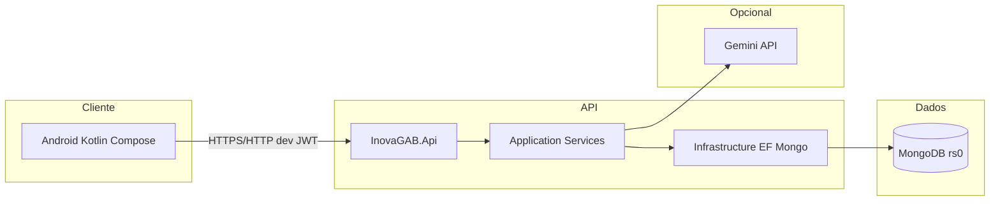
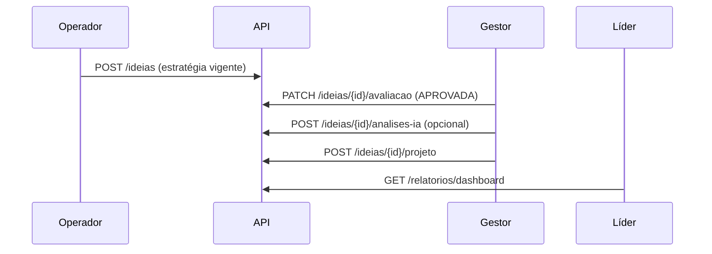

# InovaGAB — Apresentação Sprint 2

**Equipe:** [NOME] — RM [RM]  
**Disciplina / turma:** [preencher conforme enunciado FIAP]  
**Data:** 2026-09-20  
**Repositório:** monorepo InovaGAB (Android + backend .NET 8)

> **Entrega PDF/PPT:** exportação para slide deck **PENDENTE** (sem LibreOffice/pandoc no pipeline do agente). Este Markdown é rascunho obrigatório; a entrega formal FIAP exige arquivo **PDF ou PPT** legível — gerar localmente a partir deste conteúdo ou registrar pendência no [`CHECKLIST_ENTREGA.md`](./CHECKLIST_ENTREGA.md).

---

## 1. Problema

Empresas precisam capturar ideias de colaboradores, alinhar iniciativas a **estratégias de inovação**, priorizar com gestores, converter aprovadas em **projetos** com indicadores financeiros e dar visibilidade a líderes via **dashboard** e **ranking**. Na Sprint 1 o app Android usava Firebase; na Sprint 2 o desafio é **API própria**, persistência **NoSQL**, segurança **JWT** e integração mobile real — com diferencial **IA** para apoiar (não substituir) a decisão do gestor.

---

## 2. Evolução Sprint 1 → Sprint 2

| Aspecto | Sprint 1 | Sprint 2 |
|---------|----------|----------|
| Persistência | Firebase Auth + Firestore | MongoDB + seed demo (`*@inovagab.local`) |
| Autenticação | Firebase | JWT access + refresh rotativo |
| Regras de negócio | Largamente no app | Servidor (perfis, transições, conversão) |
| Dashboard / ROI | Cálculo local | `GET /api/v1/relatorios/*` |
| IA | — | Gemini `gemini-2.0-flash` (opcional) |
| Testes / CI | Limitados | xUnit, integração Mongo, scripts, GHA |

Firebase **não foi apagado** no histórico do repositório; o fluxo atual do app Sprint 2 consome **REST**.

---

## 3. Arquitetura backend

Camadas: **Api** (controllers, middleware, Swagger), **Application** (casos de uso), **Domain**, **Infrastructure** (`InovaGabDbContext`, repositórios, seed, cliente IA).

---

## 4. NoSQL e EF Core

- **Sem SQL Server** e **sem migrations SQL**.
- `MongoDB.EntityFrameworkCore` para CRUD e consultas; agregações de relatório via repositório dedicado.
- Replica set **rs0** (Compose) para **transações** (ex.: conversão ideia → projeto).
- Limites: paginação `pageSize` máx. 100; exclusões lógicas; concorrência via campo `versao` + header `If-Match` em DELETE.

---

## 5. Segurança

- Senhas: `PasswordHasher<Usuario>` — hash **nunca** na API.
- JWT: issuer/audience/secret configuráveis; access ~15 min; logout revoga **refresh** (access válido até expirar).
- Autorização por política: `Lider`, `Gestor`, `Operador`.
- Rate limit: login e análises IA.
- **Release Android:** sem cleartext HTTP (`debug` apenas com `usesCleartextTraffic` para `10.0.2.2:8080`).

---

## 6. Fluxo integrado (exemplo)

---

## 7. Exemplos de endpoints

| Ação | Chamada |
|------|---------|
| Login | `POST /api/v1/auth/login` |
| Listar ideias (gestor) | `GET /api/v1/ideias?page=1` |
| Converter | `POST /api/v1/ideias/{id}/projeto` |
| Dashboard | `GET /api/v1/relatorios/dashboard?estrategiaId=...` |

Detalhes: [`ENDPOINTS.md`](./ENDPOINTS.md), Postman em `deliverables/postman/`.

---

## 8. Gráficos (líder)

App Android: gráficos Canvas no dashboard (filtros por estratégia/projeto/período); ROI `null` → **“Não aplicável”**.

---

## 9. IA (Plus)

| Item | Valor |
|------|-------|
| Modelo configurado | `gemini-2.0-flash` (`AI_MODEL` / `AI__Model`) |
| Endpoint | Google `generateContent` + JSON Schema |
| Core sem IA | API sobe; `POST .../analises-ia` → **503** `IA_INDISPONIVEL` |
| Teste real | **PENDENTE** — ver [`IA_EVIDENCIA.md`](./IA_EVIDENCIA.md) |
| Chave necessária | `AI_API_KEY` + quota Google AI Studio |

Prompt/schema: [`IA_GEMINI.md`](./IA_GEMINI.md); implementação `GeminiIdeiaAnalysisClient`.

---

## 10. Testes

| Tipo | Onde |
|------|------|
| Unit ROI | `tests/InovaGAB.UnitTests` |
| Integração Mongo / HTTP | `tests/InovaGAB.IntegrationTests` |
| E2E jornada | `Sprint2JornadaHttpE2ETests` |
| IA externa opt-in | `InovaGAB.IaExternalTests` |
| Android unit + lint + APK | `scripts/test-android.sh` |
| Guia | [`COMO_TESTAR.md`](./COMO_TESTAR.md) |

---

## 11. Demonstração mobile

- **Emulador:** `API_BASE_URL` debug = `http://10.0.2.2:8080/`
- **Celular físico:** rebuild debug com IP LAN da máquina host (ex. `http://192.168.x.x:8080/`) e mesma rede Wi‑Fi; API exposta apenas em `127.0.0.1:8080` no Compose — usar `dotnet run` ou ajustar bind para demo em rede local.

APK debug empacotado em `deliverables/InovaGAB_Android_Sprint2.zip` via `scripts/package-delivery.sh`.

---

## 12. Encerramento

Sprint 2 entrega backend modular, app integrado, documentação e scripts de avaliação. Pendências explícitas: nomes/RM, PDF/PPT, evidência IA real, validação Docker completa em CI remoto — ver checklist.
