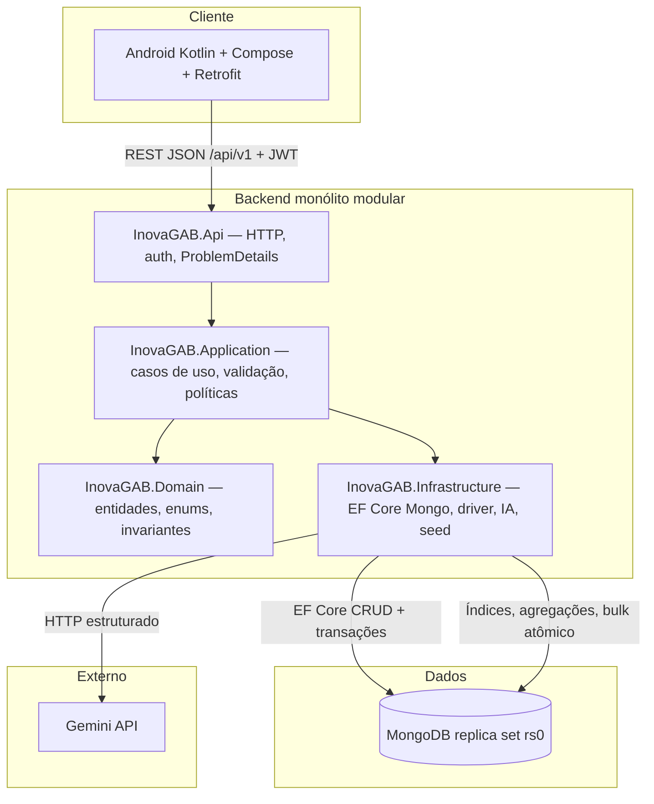
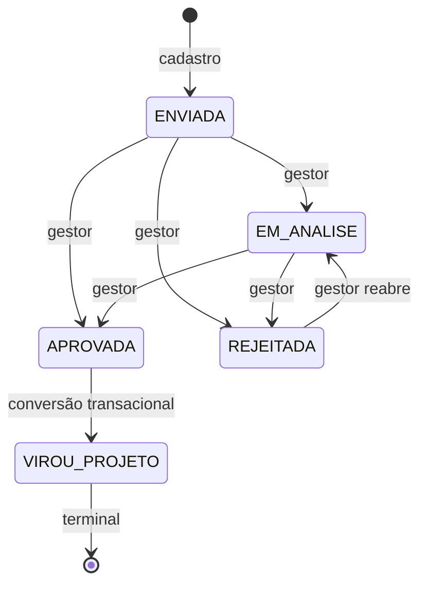

# InovaGAB Sprint 2 — Plano de execução

**Etapa:** 1 (diagnóstico local e contrato)  
**Base de referência:** commit `9665412ce08110cf2e1f11ded6e5adbb13e9ec9d`  
**Checkout analisado:** `b5acf7eee36347836cd34a59a1ff7b8f6fca3ac8` (inclui `docs/sprint2/InovaGAB_Sprint2_Guia_e_Prompts_Cursor.md`; Android Sprint 1 preservado)

Este documento consolida arquitetura, regras de negócio e decisões técnicas para a Sprint 2. A implementação de CRUDs e integração Android ocorre nas etapas seguintes (prompts 2–10 do `GUIA_CURSOR.md`).

---

## 1. Objetivo da Sprint 2

Evoluir o InovaGAB de um app Android acoplado ao Firebase para uma solução integrada: **API .NET 8** com **MongoDB**, **JWT**, regras de negócio no servidor, relatórios agregados, ranking por eventos, conversão transacional ideia→projeto e **análise de ideias por IA (Gemini)** como diferencial Plus.

---

## 2. Arquitetura

### 2.1 Visão geral

### 2.2 Estrutura de pastas (alvo)

| Caminho | Conteúdo |
|---|---|
| `backend/InovaGAB.sln` | Solution .NET 8 |
| `backend/src/InovaGAB.Api` | Controllers, middleware, Swagger |
| `backend/src/InovaGAB.Application` | Handlers/serviços, DTOs de aplicação |
| `backend/src/InovaGAB.Domain` | Entidades, value objects, exceções de domínio |
| `backend/src/InovaGAB.Infrastructure` | DbContext, repositórios, Gemini, inicialização |
| `infra/` | Docker, compose, scripts de replica set |
| `scripts/` | setup-dev, smoke, testes, empacotamento |
| `tests/` | xUnit integração + opt-in IA |
| `docs/sprint2/` | Contrato, rastreabilidade, STATUS |
| `deliverables/` | ZIPs finais (etapa 10) |

Android permanece na raiz do repositório; Firebase **não** é alterado remotamente; novo banco MongoDB com seed de demonstração.

### 2.3 Stack e pacotes propostos (validar na etapa 2)

| Componente | Versão proposta | Fonte / nota |
|---|---|---|
| SDK .NET | **8.0.x** (último patch estável do canal 8) | [Download .NET 8](https://dotnet.microsoft.com/download/dotnet/8.0) |
| Runtime ASP.NET | **8.0.x** | Alinhado ao SDK |
| `Microsoft.EntityFrameworkCore` | **8.0.30** | Requerido por `MongoDB.EntityFrameworkCore` 8.4.4 |
| `MongoDB.EntityFrameworkCore` | **8.4.4** | Provider EF para MongoDB em .NET 8; patch de segurança set/2026 |
| `MongoDB.Driver` | **3.11.2** | Dependência transitiva do provider; uso explícito na Infrastructure |
| Imagem MongoDB (dev/test) | **mongo:7.0** (fixar digest na etapa 2) | Servidor ≥ 5.0; replica set para transações |
| `Microsoft.AspNetCore.Authentication.JwtBearer` | **8.0.x** | JWT |
| `Microsoft.Extensions.Identity.Core` | **8.0.x** | `PasswordHasher<TUser>` apenas |
| Gemini (Plus) | SDK/HTTP conforme doc oficial na etapa 6 | Modelo configurável |

**Não utilizar:** SQL Server, `IdentityDbContext` relacional, migrations SQL, EF “decorativo” sem persistência real.

### 2.4 EF Core + driver MongoDB — divisão de responsabilidades

| Operação | Mecanismo preferido | Motivo |
|---|---|---|
| CRUD de usuário, estratégia, ideia, projeto, refresh token | **EF Core** (`SaveChanges`, concorrência por token) | Manter modelo único e change tracker |
| Histórico de estratégia (embed ou coleção owned) | **EF** dentro de **uma** transação de contexto | Atomicidade criação/edição + snapshot |
| Conversão ideia→projeto + status + evento pontos | **Uma sessão** Mongo: transação EF **ou** driver com `IClientSessionHandle` — **nunca** duas sessões independentes | Garantir tudo-ou-nada |
| Índice único parcial `ideiaId` em projetos | **Driver** (`CreateIndexModel` + filtro) | EF não substitui gestão de índices idempotente |
| Índice único `(autorId, ideiaId, tipo)` em eventos de pontuação | **Driver** | Idempotência de pontuação |
| Agregações de dashboard/relatórios/ranking | **Driver** (pipeline `$match`, `$group`, `$facet`) | `GroupBy`/joins EF limitados no provider |
| `ExecuteUpdate`/`ExecuteDelete` em lote | EF 8 com cautela (sem checagem de concorrência) | Usar só onde documentado |

**Limitações assumidas (não tratar como SQL):** sem migrations; `GroupBy` e includes cross-collection limitados; projeções complexas podem exigir driver LINQ ou aggregation. Transações exigem replica set. Não misturar `SaveChanges` e `InsertOne` em sessões diferentes afirmando atomicidade.

### 2.5 Identity: componentes usados vs Identity completo

| Aspecto | **O que usamos (Sprint 2)** | **Identity completo (não adotado)** |
|---|---|---|
| Hash de senha | `PasswordHasher<TUser>` de `Microsoft.Extensions.Identity.Core` | `UserManager`, validadores de senha configuráveis |
| Autenticação HTTP | JWT Bearer customizado (claims `sub`, `role`, `jti`, etc.) | Cookie + `SignInManager` |
| Armazenamento | Entidade `Usuario` no Mongo via EF/repositório | `IdentityDbContext` + tabelas SQL ou `IUserStore` completo |
| Roles | Claim `role` = `OPERADOR` \| `GESTOR` \| `LIDER` | `RoleManager`, normalização de roles |
| Refresh | Coleção própria com hash do token, rotação | Não faz parte do Identity padrão |

**Distinção:** o enunciado cita “ASP.NET Identity/JWT”; implementamos **JWT + PasswordHasher do Identity**, que cobre armazenamento seguro de senha sem o pipeline completo de `UserManager`. Se for exigido Identity integral, será necessário implementar stores Mongo (`IUserStore`, `IUserPasswordStore`, etc.) — fora do escopo mínimo acordado no guia, mas documentado para o professor.

---

## 3. Matriz de permissões (servidor)

Autorização por policy + **verificação de propriedade** em consultas por id e em filtros (não apenas ocultar menu no Android).

| Operação | OPERADOR | GESTOR | LIDER |
|---|---|---|---|
| `POST/POST refresh/POST logout/GET me` | Sim | Sim | Sim |
| Estratégias: listar/detalhe/histórico | Sim | Sim | Sim |
| Estratégias: criar/editar/excluir lógica | Não | Não | Sim |
| Ideias: CRUD próprias; editar/excluir só `ENVIADA` | Sim (próprias) | Não | Não |
| Ideias: listar todas, avaliar (`PATCH avaliacao`) | Não | Sim | Não |
| `POST ideias/{id}/projeto` (conversão) | Não | Sim | Não |
| Projetos: CRUD | Não | Sim | Não |
| Projetos: consulta | Não | Sim | Sim |
| Relatórios/dashboard | Não | Não | Sim |
| Ranking | Sim | Sim | Sim |
| Análises IA | Não | Sim | Não |
| `GET usuarios/responsaveis` | Não | Sim | Não |

**Regras adicionais:** sem cadastro público; role nunca aceita do cliente em criação de usuário; líder **não** herda permissões de gestor.

---

## 4. Entidades de domínio (persistência)

Convenção BSON: **camelCase** nos documentos; IDs **string** (GUID ou ObjectId stringificado — decisão na etapa 2, preferência GUID string para alinhar ao Android).

### 4.1 Usuario

| Campo | Tipo | Notas |
|---|---|---|
| `id` | string | PK |
| `nome` | string | |
| `email` | string | Exibição |
| `emailNormalizado` | string | Único, lowercase |
| `passwordHash` | string | Nunca exposto na API |
| `perfil` | enum | OPERADOR, GESTOR, LIDER |
| `ativo` | bool | Gestor responsável deve estar ativo |
| `criadoEm` | instante UTC | |
| `demo` | bool | Seed de demonstração |

Pontos **não** são campo editável: derivados de eventos (ranking).

### 4.2 Estrategia (evolução de Orientacao)

| Campo | Tipo | Notas |
|---|---|---|
| `id` | string | |
| `titulo`, `descricao` | string | |
| `categoria`, `campanha` | string | Filtros e UI |
| `inicioVigencia`, `fimVigencia` | date (`yyyy-MM-dd`) | Datas civis |
| `ativa` | bool | Arquivamento lógico de vigência |
| `versao` | int | Concorrência + referência em ideias/projetos |
| `criadoEm`, `atualizadoEm` | instante UTC | |
| `excluidaEm` | instante UTC? | Exclusão lógica; null = ativa no catálogo |

### 4.3 EstrategiaHistorico (imutável)

| Campo | Tipo | Notas |
|---|---|---|
| `id` | string | |
| `estrategiaId` | string | |
| `versao` | int | Versão após o evento |
| `acao` | enum | CRIADA, EDITADA, ARQUIVADA, EXCLUIDA_LOGICAMENTE |
| `atorId` | string | |
| `ocorridoEm` | instante UTC | |
| `snapshot` | objeto | Título, descrição, categoria, campanha, vigência, ativa |

Gravação **atômica** com a mutação da estratégia.

### 4.4 Ideia

| Campo | Tipo | Notas |
|---|---|---|
| Campos Sprint 1 | titulo, descricao, area | |
| `autorId` | string | Do JWT |
| `status` | StatusIdeia | |
| `prioridade` | PrioridadeIdeia | Gestor na avaliação |
| `estrategiaId`, `estrategiaVersao` | string, int | Fixados no cadastro/novo vínculo |
| `versao` | int | Concorrência otimista |
| `excluidaEm` | instante UTC? | Exclusão lógica (operador, ENVIADA) |
| `criadoEm`, `atualizadoEm` | instante UTC | |

### 4.5 Projeto

| Campo | Tipo | Notas |
|---|---|---|
| Campos Sprint 1 | nome, descricao, etapa, status, valores, prazo | |
| `ideiaId` | string? | Preenchido na conversão; vazio na criação direta |
| `estrategiaId`, `estrategiaVersao` | string, int | |
| `responsavelId` | string | Gestor ativo |
| `investimento`, `retornoFinanceiro`, etc. | decimal / Decimal128 | ≥ 0; limites de % documentados na API |
| `versao` | int | Concorrência |
| `excluidaEm` | instante UTC? | Exclusão lógica |

### 4.6 EventoPontuacao

| Campo | Tipo | Notas |
|---|---|---|
| `id` | string | |
| `autorId`, `ideiaId` | string | |
| `tipo` | enum | CADASTRO (+10), PRIMEIRA_APROVACAO (+30) |
| `pontos` | int | Fixo por tipo |
| `ocorridoEm` | instante UTC | |

Índice único composto `(autorId, ideiaId, tipo)` — segunda aprovação não duplica.

### 4.7 RefreshToken, Auditoria, AnaliseIa

Documentados no `CONTRATO_API.md` e OpenAPI; persistência na etapa 3+.

---

## 5. Vigência de estratégia

- **Data de negócio:** fuso `America/Sao_Paulo` para calcular “hoje” e comparar com `inicioVigencia` / `fimVigencia` (datas civis, sem hora).
- **Instantes técnicos:** UTC (`criadoEm`, auditoria, tokens).
- **Vigente:** `excluidaEm == null`, `ativa == true`, e `inicioVigencia <= hojeSP <= fimVigencia` (se `fimVigencia` null, sem teto).
- **Múltiplas vigentes:** permitido; usuário escolhe uma no cadastro.
- **Cadastro de ideia/projeto e conversão:** exigem estratégia **vigente** no momento da operação; estratégia apenas arquivada/histórica pode ser referenciada em leituras.

---

## 6. Transições de status (ideia)

- Repetir o mesmo status: **idempotente** (200/204 conforme contrato).
- Transição ilegal: **409** com `code` específico.
- Operador: edição/exclusão lógica apenas em `ENVIADA` e sendo dono.
- `APROVADA → VIROU_PROJETO` **somente** via `POST /ideias/{id}/projeto`, não via PATCH.

---

## 7. Propriedade e isolamento

| Recurso | Regra |
|---|---|
| Ideia | `autorId == sub` do JWT para CRUD operador; gestor lê todas; filtro `autorId` adulterado não expande escopo |
| Projeto | Gestor CRUD; líder só leitura; operador 403/404 |
| Estratégia | Líder muta; demais leem conforme matriz |
| Avaliação / conversão / IA | Gestor + ideia existente e autorizada |

Respostas **404** para recurso inexistente ou não autorizado quando a revelação de existência for sensível (alinhar ao guia).

---

## 8. Exclusão lógica

| Entidade | Quem exclui | Efeito |
|---|---|---|
| Estratégia | LIDER | `excluidaEm` preenchido; histórico preservado; **impede novos vínculos**; listagens padrão omitem |
| Ideia | OPERADOR (dono, ENVIADA) | `excluidaEm`; pontos já concedidos **permanecem** (decisão documentada) |
| Projeto | GESTOR | `excluidaEm`; fora de totais de relatório; **não** reabre ideia para segunda conversão |

Consultas históricas e detalhes autorizados podem expor referências a estratégias arquivadas/excluídas sem permitir seleção em novos cadastros.

**HTTP:** exclusões lógicas via `DELETE` com cabeçalho **`If-Match`** contendo a versão de concorrência esperada (ver `CONTRATO_API.md`).

---

## 9. Concorrência otimista

| Operação | Mecanismo |
|---|---|
| `PUT` estratégia, ideia, projeto | Campo `versao` no body; deve coincidir com persistido; senão **409** `CONCORRENCIA` |
| `PATCH` avaliação | `versao` da ideia no body |
| `POST` conversão | `versao` da ideia no body |
| `DELETE` lógico | Header **`If-Match: W/"{versao}"`** (weak ETag textual da versão inteira) |

Após sucesso, `versao` incrementada (estratégia também incrementa versão de negócio e gera histórico).

---

## 10. Pontuação e ranking

| Evento | Pontos | Momento |
|---|---|---|
| `CADASTRO` | +10 | Após criar ideia (mesma transação persistência ideia + evento) |
| `PRIMEIRA_APROVACAO` | +30 | Primeira transição para `APROVADA` (mesma transação status + evento) |

- Ranking: soma de eventos por `autorId`, ordenação `pontos DESC`, `nome ASC`, `id ASC`.
- API de ranking: posição, nome, pontos — **sem email**.
- Exclusão lógica da ideia não remove eventos (decisão de produto para esta versão).

---

## 11. Conversão ideia → projeto

**Pré-condições:** gestor autenticado; ideia `APROVADA`; `versao` coincide; estratégia vinculada ainda **vigente**; ideia não `VIROU_PROJETO`; sem projeto ativo com mesmo `ideiaId`.

**Efeitos (uma transação Mongo):**

1. Criar `Projeto` com `ideiaId`, `estrategiaId`/`estrategiaVersao` herdados, demais campos do body.
2. Atualizar ideia para `VIROU_PROJETO`.
3. Não chamar IA dentro da transação.

**Idempotência / concorrência:** índice único parcial em `projetos` onde `ideiaId` não vazio; retry retorna **409** com projeto existente ou conflito documentado. Exclusão lógica do projeto **não** permite nova conversão da mesma ideia.

**Criação direta de projeto:** `POST /projetos` sem `ideiaId` (ou rejeitar se enviado) — não contorna conversão.

---

## 12. Relatórios (líder)

- Lucro = retorno − investimento; ROI = lucro / investimento × 100; investimento 0 → ROI `null`.
- Não somar ROIs; não duplicar redução de custos no lucro.
- Ganho de produtividade: média simples documentada.
- Filtro temporal: **data de criação do projeto** (`criadoEm`).
- Projetos com `excluidaEm` fora dos agregados.
- Séries para gráficos: investimento vs retorno por estratégia; distribuição por status — sem série financeira mensal inventada.

Implementação: agregações Mongo no repositório de relatórios (driver).

---

## 13. IA (Plus)

Análise real via Gemini; entrada mínima (título, área, descrição da ideia + conteúdo da estratégia); saída JSON validada; persistência com `promptVersion` e hash da entrada; análise marcada desatualizada se ideia editada. Não altera status, pontos ou prioridade final.

---

## 14. Segurança e auditoria

- JWT curto (~15 min); refresh opaco, hash armazenado, rotação uso único; logout revoga refresh (access válido até expirar).
- Auditoria: ator, ação, recurso, instante UTC, `correlationId` — sem segredos.
- Rate limit em login; mensagem genérica para credenciais inválidas.

---

## 15. Próximas etapas (referência)

| Etapa | Entrega |
|---|---|
| 2 | Solution, Docker, health, teste EF↔Mongo |
| 3 | Auth + seed usuários |
| 4 | Estratégias + ideias + pontos |
| 5 | Projetos + conversão + relatórios + ranking |
| 6 | IA Gemini |
| 7–8 | Android Retrofit + telas |
| 9–10 | CI, testes, entrega |

---

## 16. Documentos relacionados

- `CONTRATO_API.md` — contrato HTTP humano-legível  
- `openapi.yaml` — especificação OpenAPI 3.0  
- `RASTREABILIDADE.md` — requisito → endpoint → tela → teste  
- `STATUS.md` — estado atual da sprint  
